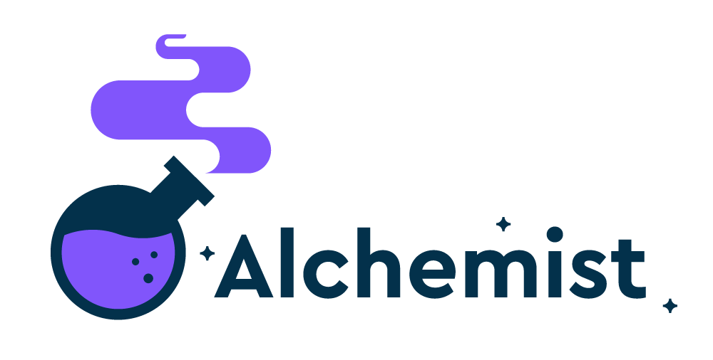

# Alchemist
Alchemist is an AWS Lambda powered ETL (**E**xtract, **T**ransform, **L**oad) engine focused on managing data coming from multiple sources, in an efficient and streamlined way, by using pipelines.


[](https://www.npmjs.com/package/alchemist)
[](https://circleci.com/gh/blinkist/blinkist-alchemist)


If your data-related needs oscillate around any of the following:

1. loading data from multiple sources, reacting to triggers,
2. clean-up and transformation to desired format,
3. formatting data between stages and engines in a custom data processing workflow,

then Alchemist will be the right tool for you!


## The concept of Alchemist

Alchemist was designed with 2 goals in mind:

1. *Be lightweight*: Alchemist can be installed and used in any JavaScript project.
2. *Be flexible*: Alchemist comes with built-in adapters, while being extensible with custom adapters as needed.

While the typical flow of data in an ETL engine is:

- E(xtract): read data from source,
- T(ransform): process the data,
- L(load): load the data into the next processing stage or engine,

Alchemist offers more flexibility, by storing both valid (parseable) and invalid (malformed) data between steps in a pipeline. This distinction allows for deeper and more detailed processing of _valid_ data, while keeping seemingly _invalid_ data safely stored for further analysis and improvements.

The full data processing pipeline is demonstrated in the following diagram:


### Additional resources

A more in depth look about [how we use alchemist](https://www.slideshare.net/SebastianSchleicher/tracking-and-business-intelligence)

## Installation TODO

Use `npm` to add the dependency in your `package.json` file:

    $ npm install alchemist

Or install it globally with:

    $ npm install --global alchemist

## Usage

Each pipeline is an AWS Lambda function, e.g.:

```javascript
async call() {
  // Step 1: Define input from Kinesis:
  let input = Input.instanceFor(this.adapterRegistry, 'KinesisInput', { events: this.event.events() })

  // Step 2: Define transformations sequence:
  let transformations = [
    Transformation.instanceFor(this.adapterRegistry, 'FirstEventTransformation'),
    Transformation.instanceFor(this.adapterRegistry, 'SecondEventTransformation'),
    Transformation.instanceFor(this.adapterRegistry, 'ThirdEventTransformation')
  ]

  // Step 3: Define output to Kinesis:
  let output = Output.instanceFor(this.adapterRegistry, 'KinesisOutput', {stream_name: 'output-kinesis-stream'})

  // Step 4: Use console for invalid output
  // Note: ConsoleOutput is a preregistered Adapter!
  let invalidOutput = Output.instanceFor(this.adapterRegistry, 'ConsoleOutput', { })

  // Step 5: Execute the pipeline:
  let pipeline = new Pipeline({
    input:            input,
    transformations:  transformations,
    output:           output,
    invalidOutput:    invalidOutput
  })

  await pipeline.call()
}
```

[Review a complete example](example/app/services/pintpoint_service.js) to learn more about the complete pipeline structure.

## Development

After checking out the repo, run `yarn install` to install dependencies. Then, run `docker-compose run --rm test` to run the tests.

To install this library onto your local machine, run `npm install`. To release a new version, run `npm version <update_type>` to update the version number in `package.json`, and then run `npm publish`, which will push the library to [npmjs.com](https://www.npmjs.com/).

## License

The npm package is available as open source under the terms of the [MIT License](https://opensource.org/licenses/MIT).

## Code of Conduct

Everyone interacting in the Alchemist project’s codebases, issue trackers, chat rooms and mailing lists is expected to follow the [code of conduct](https://github.com/blinkist/alchemist/blob/master/CODE_OF_CONDUCT.md).
